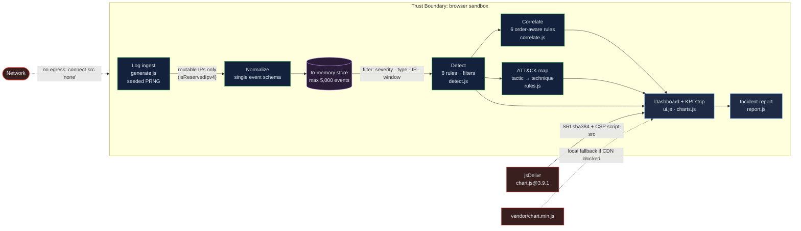

# SIEM Log Analyzer: a browser-based detection-engineering sandbox that turns raw security telemetry into ranked, ATT&CK-mapped incidents

[](https://github.com/Freddricklogan/siem-log-analyzer/actions/workflows/deploy.yml)
[](#5-getting-started--verification)
[](https://github.com/Freddricklogan/siem-log-analyzer/actions/workflows/codeql.yml)
[](LICENSE)
[](https://freddricklogan.github.io/siem-log-analyzer/)

> **Scope, stated plainly.** The security telemetry on this page is *simulated* —
> generated locally by a seeded pseudo-random generator. The detection rules,
> the ATT&CK mapping, the scoring and the correlation engine are real code with
> real tests. This is a reference implementation of the analysis layer of a SIEM,
> not a SIEM connected to a network.

## 1. Executive Summary & Business Impact

**Problem Statement.** A security operations centre does not fail because it
lacks data; it fails because it drowns in it. A mid-size enterprise generates
millions of raw log lines a day, and the expensive scarce resource is analyst
attention. The gap between "500 alerts fired" and "here are the three incidents
that matter, in this order, with evidence" is where SOC programmes succeed or
collapse — and it is almost always the part that is hand-waved in a
demonstration, because it is the part that requires actual engineering.

**Solution & Value Delivered.** This repository implements that gap. Synthetic
events are normalized into a single schema, matched against eight detection
rules, mapped to MITRE ATT&CK techniques and tactics, scored per source with a
deterministic and defensible function, and finally correlated into multi-stage
incidents by six order-aware rules that distinguish a genuine kill chain from
coincidental co-occurrence. The output is an analyst deliverable: a ranked
incident report with evidence and recommended actions. A reviewer sees the
whole path in thirty seconds, with no account, no backend and no install.

**[→ Read the full case study](docs/CASE_STUDY.md)**

| Outcome | How this repo delivers it |
| --- | --- |
| Alert volume reduced to a short, ordered incident list | Six correlation rules collapse hundreds of events into at most eight ranked findings, severity-first |
| Risk ranking a reviewer can actually defend | `computeThreatScore()` is a bounded, deterministic function of severity, log-scaled volume, attack breadth and kill-chain span — not a random number |
| Coverage expressed in a language the business already buys | Every detection carries a MITRE ATT&CK technique and tactic; coverage rolls up into the matrix |
| Findings that survive review | 95 unit tests over the pure logic at 99.78% statement coverage; order-dependence of every chain rule is asserted explicitly |
| Zero-trust demo surface | `default-src 'none'` CSP, SRI-pinned CDN script with a vendored fallback, no network egress at runtime |

## 2. Demonstrated Competencies & Technical Skills

- **Systems Architecture & CS** — Strict three-layer separation: pure logic
  (`src/rules.js`, `generate.js`, `detect.js`, `correlate.js`, `report.js`) never
  touches the DOM, the clock or the RNG; rendering (`ui.js`, `charts.js`) never
  computes; `main.js` only orchestrates. Time and randomness are injected
  parameters, which is what makes 99.78% coverage possible without a headless
  browser. Aggregations are single-pass `Map` reductions — O(n) over events, O(k log k)
  on the small grouped result — so the dashboard stays responsive at the 5,000-event cap.
- **Data Science & AI** — Deterministic composite scoring with deliberate shape:
  severity weight as the base, `log2` volume pressure so a single noisy scanner
  cannot saturate the ranking, linear breadth pressure for multi-class sources,
  and a step bonus for spanning three or more ATT&CK tactics, clamped to 0–100.
  Timeline bucketing selects a bucket width from the analysis window and emits a
  dense series so gaps read as gaps. No machine learning is claimed, because none
  is used.
- **Cybersecurity & Compliance** — Eight detections across six ATT&CK tactics
  (Credential Access, Initial Access, Discovery, Privilege Escalation, Command
  and Control, Exfiltration, Impact). Correlation rules enforce temporal ordering,
  which is the difference between a finding and a false positive. The page itself
  is hardened: `default-src 'none'`, no inline script, no inline event handlers,
  subresource integrity on the one third-party script, no runtime network egress,
  and CodeQL plus Trivy in CI. The threat model is written down in §3.
- **EdTech & Human-Centered Design** — A five-step guided tour where every step
  performs the real action it narrates: it ingests, filters, re-maps the ATT&CK
  matrix, re-runs correlation over a wider window and generates the report. The
  tour is fully keyboard-operable (arrow keys step, `Esc` closes, focus is
  trapped and restored). Severity is carried by text as well as colour; the KPI
  strip is `aria-live`; motion respects `prefers-reduced-motion`.

## 3. System Architecture & Data Flow



**Trust boundary: browser sandbox.** Everything inside the boundary executes in
the page's origin and never leaves it. The only crossings are (a) the pinned,
hash-verified Chart.js artifact entering, and (b) nothing at all leaving —
`connect-src 'none'` means the page cannot make a network request even if a
future change tried to. There is no server, no storage, no telemetry and no
third-party analytics. The simulated data never represents a real network, so
there is no sensitive data inside the boundary to protect in the first place —
the hardening exists to demonstrate the posture, and to keep a supply-chain
compromise of the CDN from becoming code execution on a reviewer's machine.

## 4. Technical Highlights & Engineering Decisions

### ADR-1: Inject the clock and the random source instead of reading globals
- **Context.** The original implementation called `Math.random()` and `Date.now()`
  inside the functions that also did the analysis. Nothing could be re-run to the
  same result, so nothing could be asserted. The `Math.random()`-based threat
  score (AUDIT B2) is the extreme case: the dashboard's headline ranking was
  literally noise, and no test could have caught that because there was nothing
  stable to compare against.
- **Decision.** Every logic function takes `now` and/or `rng` as an explicit
  parameter. `mulberry32` provides a seeded generator. `buildIncidentReport`
  takes `generatedAt`. `filterEvents` takes `now`.
- **Consequence.** Generation is reproducible (`tests/generate.test.js` asserts
  byte-identical batches for an identical seed) and the report is
  snapshot-comparable. The cost is a slightly wider signature on nine functions
  and the discipline that `main.js` is the only place allowed to call `Date.now()`.
  That trade bought 99.78% coverage on the analysis layer.

### ADR-2: Make correlation order-aware, and accept fewer findings for it
- **Context.** The original "Credential Compromise Chain" rule fired whenever an
  IP appeared in both the brute-force set and the privilege-escalation set, with
  no check on which came first (AUDIT B4). On a shuffled event stream this
  reports a compromise for an escalation that preceded any failed login. A SOC
  that trusts that rule investigates backwards.
- **Decision.** Chain rules compare timestamps: `CORR-02` requires the last
  escalation to be later than the first authentication failure; `CORR-03`
  requires the injection attempt to follow the scan; `CORR-06` requires the
  transfers to follow the first beacon. The multi-vector threshold moved from
  two attack classes to three, and findings are capped at eight.
- **Consequence.** Findings are fewer and each one is defensible; the negative
  cases are asserted directly ("does NOT fire when the escalation precedes the
  brute force"). The cost is that genuine chains whose recon phase fell outside
  the selected window are missed — a false-negative traded for a false-positive,
  which is the right direction when analyst attention is the scarce resource.
  The generator now seeds a small number of deliberate campaign actors, because
  correlation rules that can only fire on a 1-in-3.7-billion address collision
  demonstrate nothing.

### ADR-3: Pin the CDN script with SRI *and* vendor a local fallback
- **Context.** Chart.js was loaded from jsDelivr with a pinned version but no
  integrity hash, and the code called `new Chart(...)` unconditionally. If the
  CDN was unreachable — an offline reviewer, a corporate proxy, a CI runner —
  the first chart threw and every panel after it silently failed to render
  (AUDIT A4). The page looked broken, not degraded.
- **Decision.** Keep the CDN as the primary source, pinned at `chart.js@3.9.1`
  with `integrity="sha384-9Mhb…"` computed with `openssl dgst -sha384` against
  the exact published artifact and `crossorigin="anonymous"` (without which the
  browser cannot check the hash at all). Vendor the byte-identical file at
  `vendor/chart.min.js`. `src/charts.js` resolves the library asynchronously and
  injects the local copy only if the global is absent; if both fail it returns a
  no-op controller and the rest of the dashboard renders normally.
- **Consequence.** Three properties at once: a supply-chain-compromised CDN
  cannot execute (the hash fails and the browser refuses the script), the demo
  works with no network, and no single asset can take the page down. The cost is
  ~195 KB of vendored JavaScript in the repository and a small amount of loader
  code — and the discipline that the vendored copy must be re-synced whenever
  the pinned version changes.

## 5. Getting Started & Verification

**Prerequisites:** Node.js 20+ for the tests and linters. The demo itself has no
build step — `index.html` and the ES modules under `src/` run straight from disk.

```bash
git clone https://github.com/Freddricklogan/siem-log-analyzer.git
cd siem-log-analyzer
npx serve .          # one command; open the printed http://localhost:3000
```

```bash
npm install
npm test             # Vitest — unit tests for the pure logic
npm run coverage     # measured coverage report
npm run lint         # ESLint 9 flat config
npm run validate     # html-validate on index.html
```

**Measured in this repository:**

| Check | Result |
| --- | --- |
| `npm test` | **95 tests passing**, 5 files, ~1.9 s |
| `npm run coverage` | **99.78% statements**, 96.71% branches, 100% functions on `src/{rules,generate,detect,correlate,report}.js` |
| `npm run lint` | clean, 0 errors, 0 warnings |
| `npm run validate` | clean |

Everything else in this README is either a description of the code or an
explicitly stated design target. There are no benchmark numbers, because no
benchmark was run.

## 6. Live Demo & Production Showcase

**Demo:** <https://freddricklogan.github.io/siem-log-analyzer/> — no account, no
credentials, nothing leaves the browser.

**30-second guided walkthrough (for reviewers).** Press **Take the
30-second tour** in the header; each step performs the action it describes.

1. **Ingest telemetry** — generates a batch of ~360 synthetic events across all
   eight detection rules, including several multi-stage campaign actors. Watch
   the five KPIs fill in.
2. **Triage by severity** — narrows to critical alerts; the timeline, ATT&CK map
   and source ranking all recompute from the same normalized set.
3. **Map to MITRE ATT&CK** — filters to privilege escalation and shows how one
   detection lands in the kill chain as `T1068`.
4. **Correlate into incidents** — resets to the full 7-day window so every
   correlation rule can fire; read the findings panel for the chains and their
   evidence.
5. **Export the incident report** — produces the analyst deliverable: executive
   summary, correlated incidents with evidence, ATT&CK coverage, ranked sources
   and recommended actions.

Then try it manually: type `203.0` into the source-IP filter, or switch the
window to "Last hour" and watch the timeline bucket width change from hourly to
five-minute. Every number in the KPI strip is computed live from the events
currently in view.

**What to read in the code:** `src/correlate.js` for the correlation rules and
their ordering constraints, `src/rules.js` for the detection catalogue and the
threat-score function, and [`AUDIT.md`](AUDIT.md) for the 30 findings against the
previous single-file implementation and how each one was closed.

---

Freddrick Logan · [github.com/Freddricklogan](https://github.com/Freddricklogan) · [fredlogan.phd](https://fredlogan.phd)
